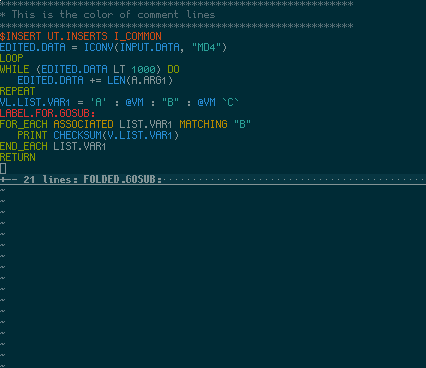

This plugin adds support for the Envision-Based Software Language (EBSL), a.k.a. Envision Basic, to vim. Features include:
* Syntax highlighting
* Indentation
* Folding for subroutines
* [vim-matchit](https://github.com/tmhedberg/matchit) support
* [vim-endwise](https://github.com/tpope/vim-endwise) support

More features may be added in the future when I feel like it.

To install using a plugin manager, follow the instructions given for your plugin manager of choice. If you do not have a plugin manager, some recommendations are [vim-plug](https://github.com/junegunn/vim-plug) and [Pathogen](https://github.com/tpope/vim-pathogen).

To install manually, the easiest way is to `git clone https://github.com/marzipanzerfaust/vim-ebsl` into any directory that makes sense to you, then add the path for the cloned repository to your runtime path with `set runtimepath^=[path/to/repo]`. It's recommended to create a new directory somewhere in your existing runtime path specifically for plugins and clone any repos for plugins into that directory for easier management.

Screenshot using [vim-colors-solarized](https://github.com/altercation/vim-colors-solarized):

